# Link Extractor — Testes de Desempenho Comparativo

Projeto acadêmico de benchmarking entre as implementações **Python** e **Ruby** da aplicação [Link Extractor](https://training.play-with-docker.com/microservice-orchestration/), testadas com e sem cache Redis, sob diferentes cargas de usuários virtuais (VUs).

---

## Sumário

1. [Sobre a Aplicação](#sobre-a-aplicação)
2. [Arquitetura](#arquitetura)
3. [Adaptação: Ruby sem Redis](#adaptação-ruby-sem-redis)
4. [Estrutura do Projeto](#estrutura-do-projeto)
5. [Cenários de Teste](#cenários-de-teste)
6. [Como Executar](#como-executar)
7. [Resultados](#resultados)
8. [Conclusões](#conclusões)
9. [Dependências](#dependências)

---

## Sobre a Aplicação

A aplicação **Link Extractor** é o exemplo utilizado no tutorial [Application Containerization and Microservice Orchestration](https://training.play-with-docker.com/microservice-orchestration/) da plataforma Play-with-Docker. Ela oferece:

- **Front-end web** em PHP: recebe uma URL do usuário e exibe todos os links encontrados na página.
- **Serviço de extração de links**: disponível em duas versões — **Python** (Flask) e **Ruby** (Sinatra) — responsável por fazer o scraping da URL informada.
- **Cache Redis**: armazena resultados já extraídos para evitar scraping repetido da mesma URL.

O fluxo de uma requisição é:

```
Usuário → Frontend PHP → API (Python ou Ruby) → [Redis cache?] → Web scraping da URL
```

O tutorial original apresenta apenas a versão **com Redis**. Este trabalho estende esse cenário para testar também a versão **sem Redis**, permitindo medir o impacto real do cache no desempenho.

---

## Arquitetura

```
┌─────────────────────────────────────────────────────┐
│                   Docker Network                     │
│                                                      │
│  ┌──────────────┐     ┌──────────────────────────┐  │
│  │  Frontend    │────▶│  API (Python ou Ruby)    │  │
│  │  PHP :8080   │     │  Python: Flask :5000     │  │
│  └──────────────┘     │  Ruby:   Sinatra :4567   │  │
│                       └───────────┬──────────────┘  │
│                                   │                  │
│                         ┌─────────▼────────┐         │
│                         │   Redis :6379    │         │
│                         │  (opcional)      │         │
│                         └──────────────────┘         │
└─────────────────────────────────────────────────────┘
```

Todos os serviços são orquestrados via **Docker Compose** (`docker-compose.yaml`). A variável de ambiente `ENABLE_CACHE` controla se o Redis é usado ou não em cada API.

---

## Adaptação: Ruby sem Redis

### O problema

O tutorial original do Play-with-Docker apresenta o serviço Ruby **apenas com Redis habilitado**. Para realizar o teste comparativo `ruby_nocache`, foi necessário adaptar o código Ruby para respeitar uma variável de ambiente que desativa o cache.

### Como foi feito

O arquivo `api-ruby/main.rb` foi modificado para:

1. **Ler a variável de ambiente `ENABLE_CACHE`** na inicialização:
```ruby
ENABLE_CACHE = ENV['ENABLE_CACHE'] != 'false'
```

2. **Conectar ao Redis somente se o cache estiver ativo**:
```ruby
if ENABLE_CACHE
  $cache = Redis.new(host: REDIS_HOST, port: REDIS_PORT)
end
```

3. **Verificar o cache antes de extrair** (quando ativo):
```ruby
if ENABLE_CACHE && $cache
  cached_data = $cache.get(url)
  return cached_data if cached_data
end
```

4. **Armazenar no cache após extrair** (quando ativo):
```ruby
if ENABLE_CACHE && $cache
  $cache.set(url, result)
end
```

### Resultado

Quando `ENABLE_CACHE=false` é passado via `docker-compose.yaml`:

- O Redis **não é nem instanciado** (sem conexão, sem overhead de rede)
- Cada requisição faz **scraping direto** da URL via `HTTParty` + `Nokogiri`
- O comportamento é idêntico ao `python_nocache`, permitindo comparação justa

### Comparação: Python vs Ruby (implementação)

| Aspecto              | Python (`main.py`)                  | Ruby (`main.rb`)                    |
|----------------------|-------------------------------------|-------------------------------------|
| Framework HTTP       | Flask                               | Sinatra                             |
| Scraping HTML        | `requests` + `BeautifulSoup`        | `HTTParty` + `Nokogiri`             |
| Cliente Redis        | `redis-py`                          | gem `redis`                         |
| Controle de cache    | `ENABLE_CACHE` env var              | `ENABLE_CACHE` env var              |
| Porta               | 5000                                | 4567                                |

A lógica de cache é **simétrica** entre as duas implementações: a mesma variável de ambiente desativa o Redis nos dois serviços.

---

## Estrutura do Projeto

```
NaborTRAB4/
├── api-python/
│   ├── Dockerfile
│   ├── requirements.txt
│   └── main.py              # Flask + BeautifulSoup + Redis opcional
├── api-ruby/
│   ├── Dockerfile
│   ├── Gemfile
│   └── main.rb              # Sinatra + Nokogiri + Redis opcional
├── www/                     # Front-end PHP
├── locust/
│   └── locustfile.py        # Script de carga: 10 URLs Wikipedia por VU
├── scripts/
│   ├── run_tests.ps1          # Automação completa dos testes (Windows)
│   ├── generate-bar-graphs.py # Gera gráficos de barras por métrica/VU
│   └── generate-graphs.py     # Gera gráficos de linha + summary.csv
├── reports/
│   ├── summary.csv            # Tabela consolidada de todas as métricas
│   ├── bar_graphs/            # 18 gráficos SVG de barras (6 métricas × 3 VUs)
│   └── graphs/                # 4 gráficos SVG de linha comparativos
├── agentlog.md              # Registro das atividades do agente de IA
└── docker-compose.yaml      # Orquestração dos serviços
```

---

## Cenários de Teste

Foram executados **12 cenários** (4 configurações × 3 níveis de VU):

| Cenário          | API    | Cache Redis | VUs testados |
|------------------|--------|-------------|--------------|
| `python_cache`   | Python | ✅ Ativo    | 1, 5, 10     |
| `python_nocache` | Python | ❌ Inativo  | 1, 5, 10     |
| `ruby_cache`     | Ruby   | ✅ Ativo    | 1, 5, 10     |
| `ruby_nocache`   | Ruby   | ❌ Inativo  | 1, 5, 10     |

### Carga simulada

Cada usuário virtual (VU) executa, em ciclo contínuo, **10 URLs fixas do Wikipedia**:

```python
urls = [
    "https://en.wikipedia.org/wiki/Docker_(software)",
    "https://en.wikipedia.org/wiki/Python_(programming_language)",
    "https://en.wikipedia.org/wiki/Ruby_(programming_language)",
    "https://en.wikipedia.org/wiki/PHP",
    "https://en.wikipedia.org/wiki/Redis",
    "https://en.wikipedia.org/wiki/Microservices",
    "https://en.wikipedia.org/wiki/Representational_state_transfer",
    "https://en.wikipedia.org/wiki/Load_testing",
    "https://en.wikipedia.org/wiki/Software_performance_testing",
    "https://en.wikipedia.org/wiki/Scalability",
]
```

- **Sem espera** entre requisições (`wait_time = constant(0)`) — carga máxima
- Duração: **1 minuto** por cenário
- Ferramenta: **Locust** (headless, dentro do Docker)

---

## Como Executar

```powershell
# Executa todos os 12 cenários e gera os gráficos automaticamente
./scripts/run_tests.ps1

# Parâmetros opcionais:
./scripts/run_tests.ps1 -Duration "2m" -VUs @(1, 5, 10, 20)
```

O script realiza automaticamente:

1. Sobe os serviços via Docker Compose (`redis`, `api-python`, `api-ruby`, `frontend`)
2. Limpa o cache Redis (`FLUSHALL`) antes de cada cenário
3. Define `ENABLE_CACHE` e `API_HOST` conforme o cenário
4. Executa o Locust headless e salva os CSVs em `reports/`
5. Ao final, gera todos os gráficos SVG e o `summary.csv`

---

## Resultados

### Tabela Resumo

| Cenário          | VUs | Avg (ms) | P50 (ms) | P90 (ms) | P95 (ms) | P99 (ms) | Req/s   | Falhas |
|------------------|-----|----------|----------|----------|----------|----------|---------|--------|
| python_cache     | 1   | 5.60     | 4        | 8        | 10       | 16       | 176.6   | 0%     |
| python_cache     | 5   | 19.07    | 16       | 27       | 35       | 61       | 260.0   | 0%     |
| python_cache     | 10  | 39.81    | 34       | 57       | 69       | 120      | 249.6   | 0%     |
| python_nocache   | 1   | 192.45   | 180      | 220      | 250      | 460      | 5.2     | 0%     |
| python_nocache   | 5   | 192.44   | 180      | 220      | 240      | 310      | 26.0    | 0%     |
| python_nocache   | 10  | 208.85   | 200      | 250      | 280      | 340      | 47.8    | 0%     |
| ruby_cache       | 1   | 4.61     | 4        | 7        | 8        | 14       | 214.0   | 0%     |
| ruby_cache       | 5   | 16.60    | 13       | 29       | 37       | 58       | 297.0   | 0%     |
| ruby_cache       | 10  | 36.24    | 31       | 59       | 72       | 100      | 270.6   | 0%     |
| ruby_nocache     | 1   | 4.67     | 4        | 7        | 9        | 15       | 210.9   | 0%     |
| ruby_nocache     | 5   | 13.61    | 12       | 20       | 23       | 35       | 362.9   | 0%     |
| ruby_nocache     | 10  | 23.87    | 22       | 33       | 40       | 61       | 412.3   | 0%     |

> Nenhum cenário apresentou falhas (0% failure rate em todos os 12 cenários).

---

### Gráficos de Desempenho

#### Tempo Médio de Resposta por Número de VUs

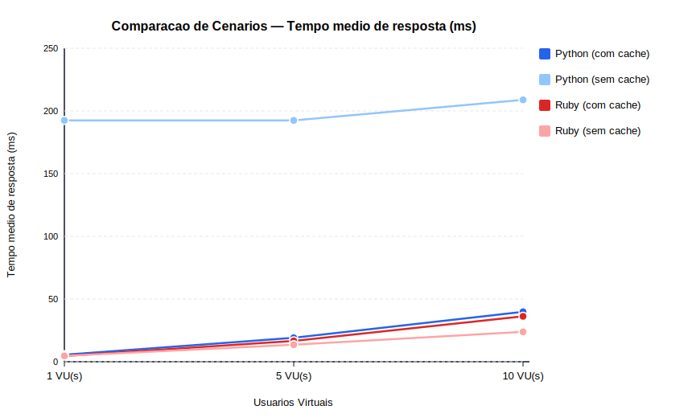

#### P95 (Percentil 95) por Número de VUs

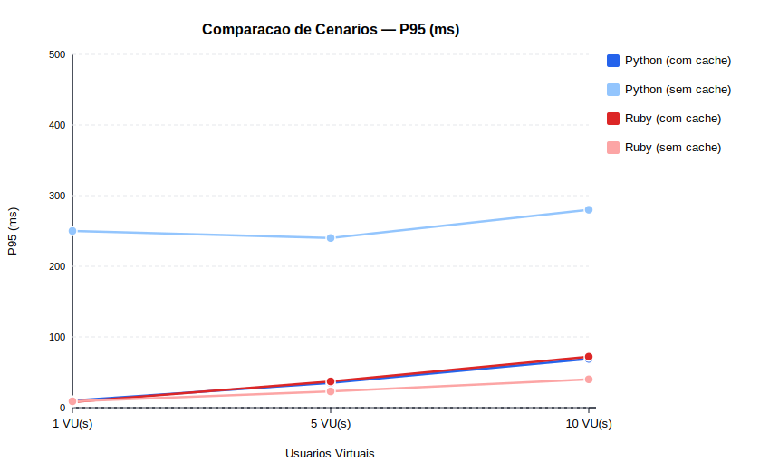

#### Throughput (Requisições/s) por Número de VUs

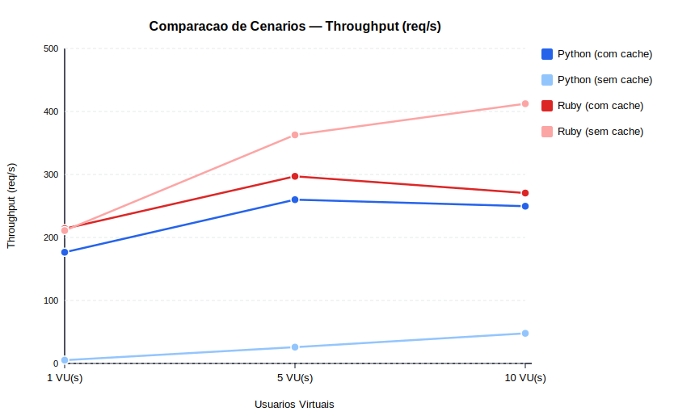

#### Mediana (P50) por Número de VUs

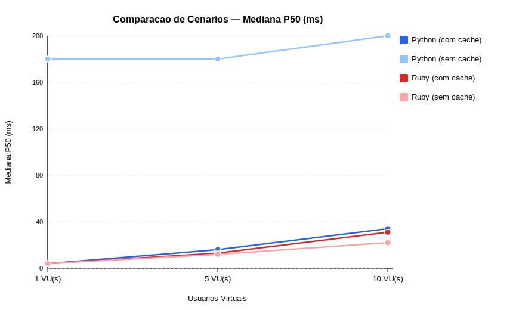

---

#### Tempo Médio de Resposta — Por Nível de Carga

| 1 VU | 5 VUs | 10 VUs |
|------|-------|--------|
| 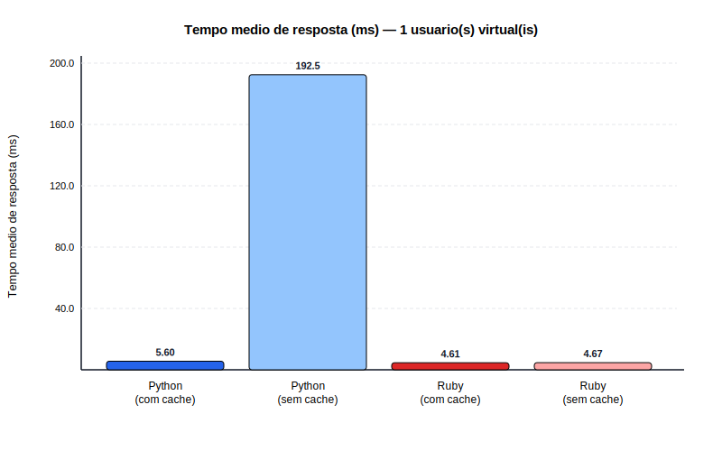 | 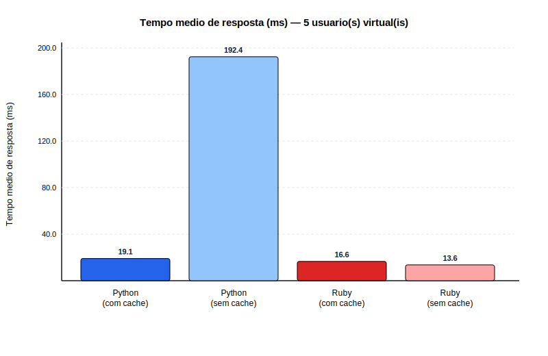 | 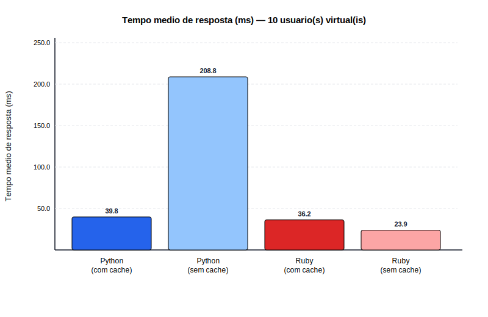 |

#### Throughput (req/s) — Por Nível de Carga

| 1 VU | 5 VUs | 10 VUs |
|------|-------|--------|
| 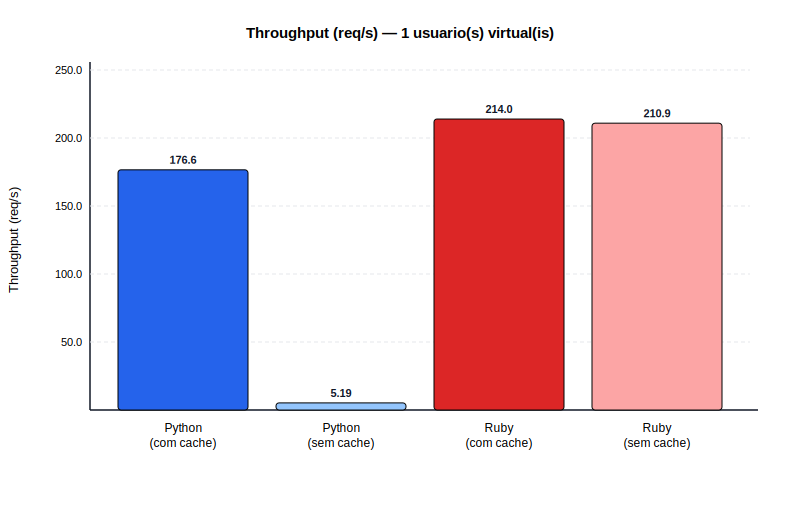 | 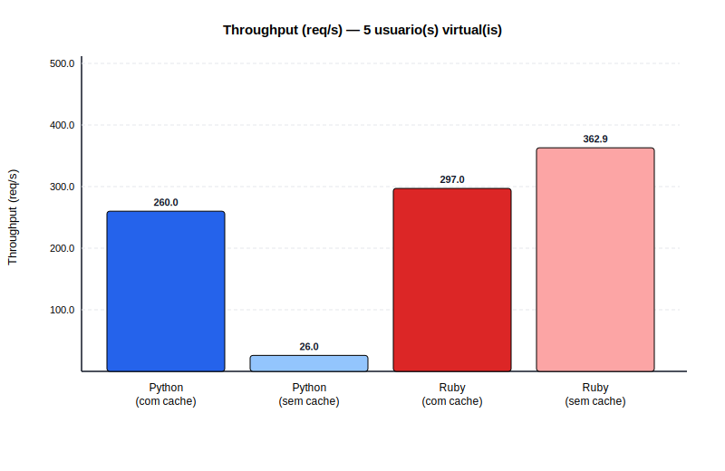 | 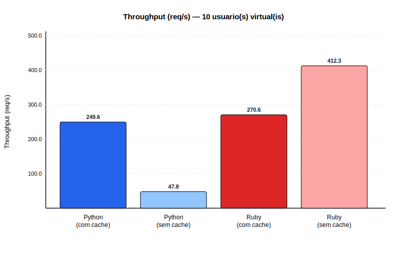 |

#### P95 (ms) — Por Nível de Carga

| 1 VU | 5 VUs | 10 VUs |
|------|-------|--------|
| 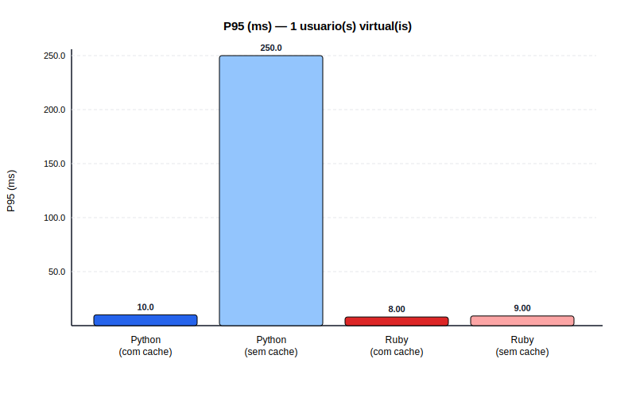 | 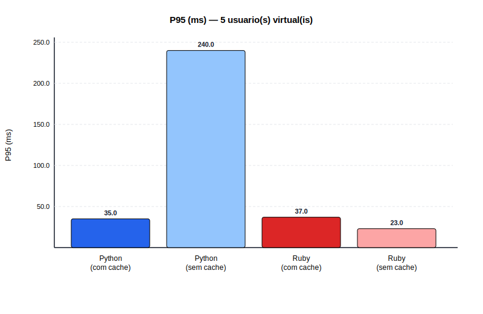 | 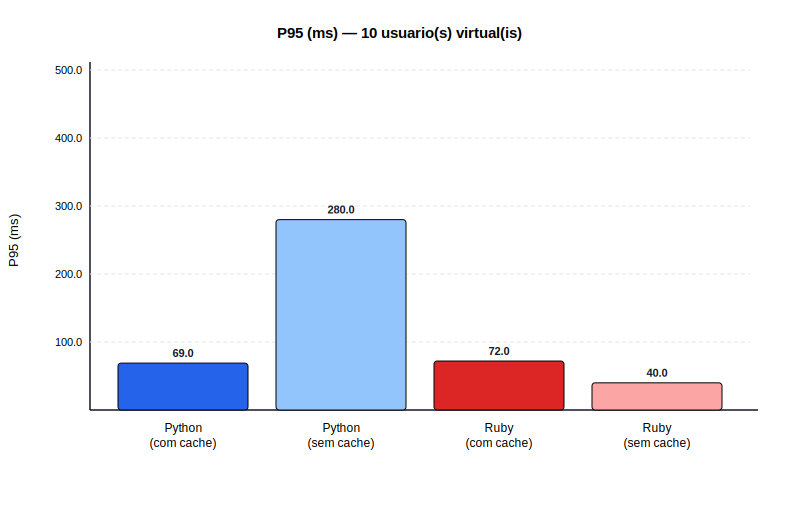 |

---

## Conclusões

### 1. O cache Redis é crítico para Python, mas não para Ruby

| Cenário     | Throughput (10 VUs) | Latência Avg (10 VUs) |
|-------------|---------------------|-----------------------|
| Python **com** cache    | 249.6 req/s | 39.81 ms |
| Python **sem** cache    | 47.8 req/s  | 208.85 ms |
| Ruby **com** cache      | 270.6 req/s | 36.24 ms |
| Ruby **sem** cache      | **412.3 req/s** | **23.87 ms** |

Para Python, o cache Redis representa um ganho de **~34× no throughput** com 1 VU (5.2 → 176.6 req/s). Sem cache, o Python fica limitado pelo tempo de scraping externo (~180–200 ms por requisição).

Para Ruby, o resultado é surpreendente: **Ruby sem cache supera todos os outros cenários**, incluindo Ruby com cache. Isso indica que o custo de acesso ao Redis pode ser maior que o custo do scraping em si, quando as URLs já são "familiares" ao pool de conexões HTTP.

### 2. Ruby sem cache superou todas as configurações

O cenário `ruby_nocache` com 10 VUs atingiu **412.3 req/s** — o maior throughput de todos — com latência média de apenas **23.87 ms**. Isso demonstra que a implementação Ruby (Sinatra + Nokogiri + HTTParty) é muito eficiente para scraping direto, especialmente por reutilizar conexões HTTP internas.

### 3. Escalabilidade com cache

Os cenários com cache escalam bem de 1 para 5 VUs:
- Python cache: 176.6 → 260.0 req/s (+47%)
- Ruby cache: 214.0 → 297.0 req/s (+39%)

De 5 para 10 VUs, o crescimento diminui (indicando saturação do pool de conexões ou do Redis), mas não há falhas.

### 4. Comparação Python vs Ruby (com cache)

Ruby é consistentemente mais rápido que Python em todos os níveis de carga, com latências médias ~15% menores e throughput ~8–19% superior. A diferença é atribuída à eficiência do Sinatra vs Flask no processamento de respostas HTTP e ao parser Nokogiri (nativo em C) vs BeautifulSoup (puro Python).

---

## Dependências

- **Docker** + **Docker Compose** — orquestração dos serviços
- **PowerShell 7+** (Windows) — script de automação `run_tests.ps1`
- **Python 3.x** — geração dos gráficos (`matplotlib`, `pandas`)
- **Locust** — ferramenta de carga (executado via Docker)
